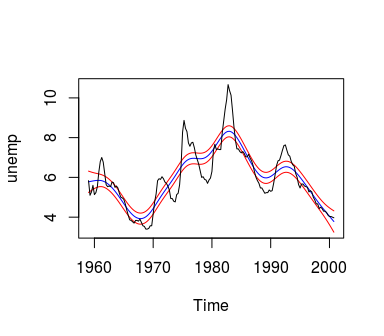

hpconf
======

Overview
--------

Provides a function for the calculation of confidence bands for the Hodrick-Prescott filter.

Installation
------------

``` r
# install.packages("devtools")
devtools::install_github("franzmohr/hpconf")
```

Usage
-----

``` r
# Load packages
library(mFilter)
library(hpconf)

# Load data
data("unemp")

# HP-filter
hp_unemp <- hpfilter(unemp)

# Obtain confidence bands
hp_conf <- hpconf(hp_unemp)

# Plot
plot(hp_conf)
```



References
----------

Giles, D. E. (2013). Constructing confidence bands for the Hodrick-Prescott filter, <em>Applied Economics Letters (20)</em>5, 480-484. <https://doi.org/10.1080/13504851.2012.714057>
